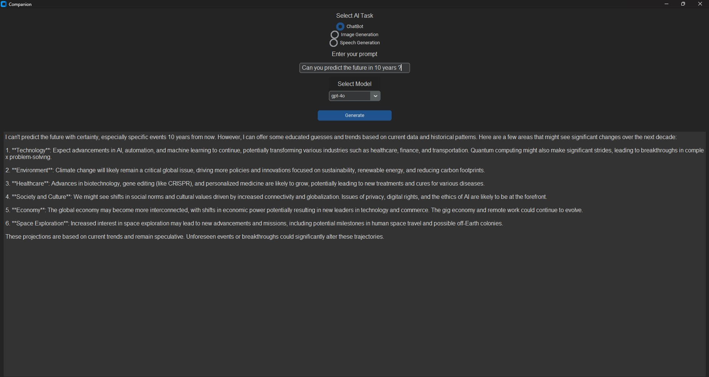
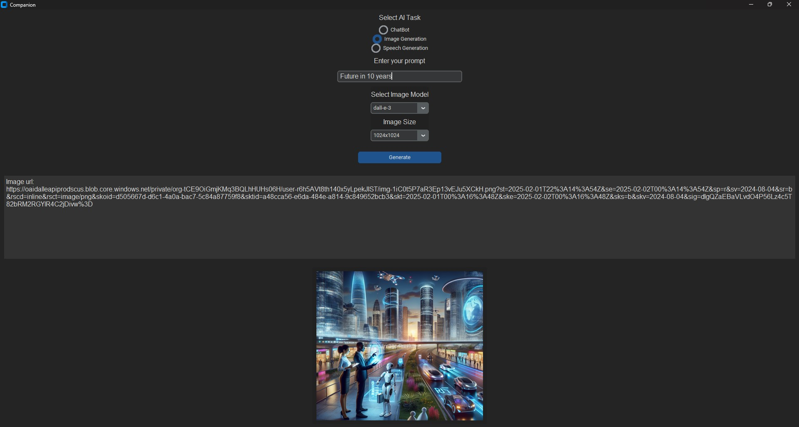
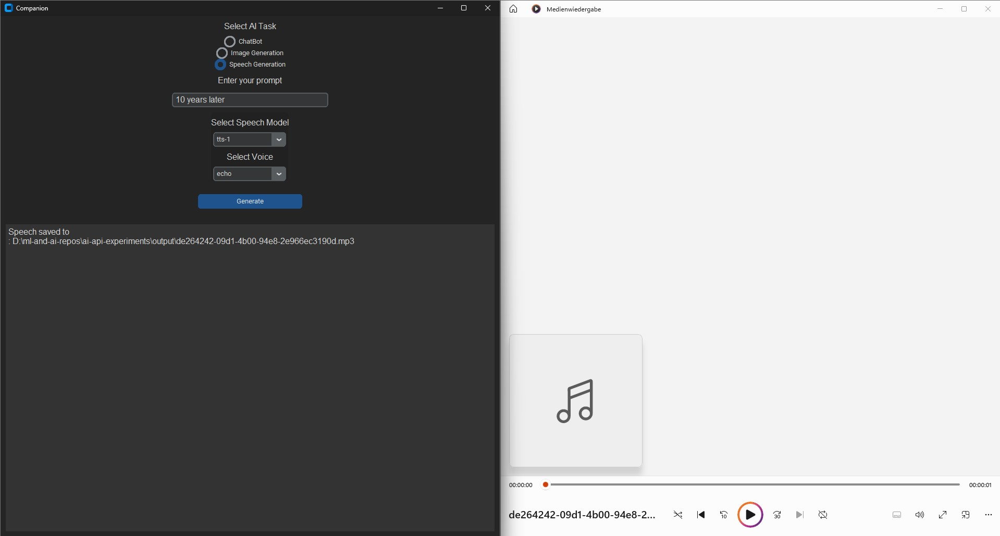

# ai-api-experiments

## Table of Contents

+ [Summary](#summary)
+ [Reference](#reference)
+ [Features](#features)
+ [Getting started](#getting-started)

## Summary

Applications providing a user-friendly interface to interact with OpenAI's AIaaS web-backends

## Reference

- [OpenAI API Reference](https://platform.openai.com/docs/api-reference/introduction)
- [OpenAI Models](https://platform.openai.com/docs/models/overview)
- [Get started with the Gemini API](https://ai.google.dev/docs)

## Features

- [x] Chat bot CLI Tool utilizing gpt-3.5-turbo or gpt-4-turbo model
- [x] Image generator CLI Tool utilizing dall-e-2 or dall-e-3 model
- [x] Speech generator CLI Tool utilizing tts-1 or tts-1-hd model
- [x] Desktop application designed to provide a user-friendly interface for interacting with OpenAI’s AIaaS web-backends enabling image generation, speech generation and chatting functionality

## Getting started

### Preconditions

- If your IDE supports it, install `Dev Containers extension` or download a [Python >=3.9.x Release](https://www.python.org/downloads/)
- Install pip dependencies: `pip install -r requirements.txt`
- Create an `API key` in your OpenAI organization
- Export the API key in a terminal process: `export OPENAI_API_KEY="<your OPENAI_API_KEY>"` 

### Utilizing CLI tools

#### Chat bot

Run:

```sh
python -m cli.chat_bot_app --prompt "<your prompt>" --model "<gpt-4o, gpt-4o-mini, o1, o3-mini>"
```

On larger prompts consider creating a separate file and reading the content of the file into a variable:

```sh
vi prompt.txt
prompt=$(cat prompt.txt)
python -m cli.chat_bot_app --prompt "$prompt" --model "<gpt-4o, gpt-4o-mini, o1, o3-mini>"
```

**NOTE:** You might need to change your billing plan, if you encounter the error `openai.RateLimitError: Error code: 429 - {'error': {'message': 'You exceeded your current quota, please check your plan and billing details. For more information on this error, read the docs: https://platform.openai.com/docs/guides/error-codes/api-errors.', 'type': 'insufficient_quota', 'param': None, 'code': 'insufficient_quota'}}`

#### Image generator

Install pip dependencies and run application:

```sh
python -m cli.image_generator_app --model "<dall-e-2, dall-e-3>" --prompt "<your prompt>" --size "<size of the image to be generated, e.g. 1024x1024>"
# Checkout link of `Generated image URL` in a browser of choice
```

**NOTE:** ["When using DALL·E 3, images can have a size of 1024x1024, 1024x1792 or 1792x1024 pixels."](https://platform.openai.com/docs/guides/images/usage?context=node)

#### Speech generator

Install pip dependencies and run application:

```sh
python -m cli.speech_generator_app --model "tts-1-hd" --voice "alloy" --prompt "<your prompt>" --output-file "<absolute path to outputs folder>/response.audio.mp3"
```

### Launching Desktop app

Run:

```sh
python -m desktop.companion
```

Resulting images:





